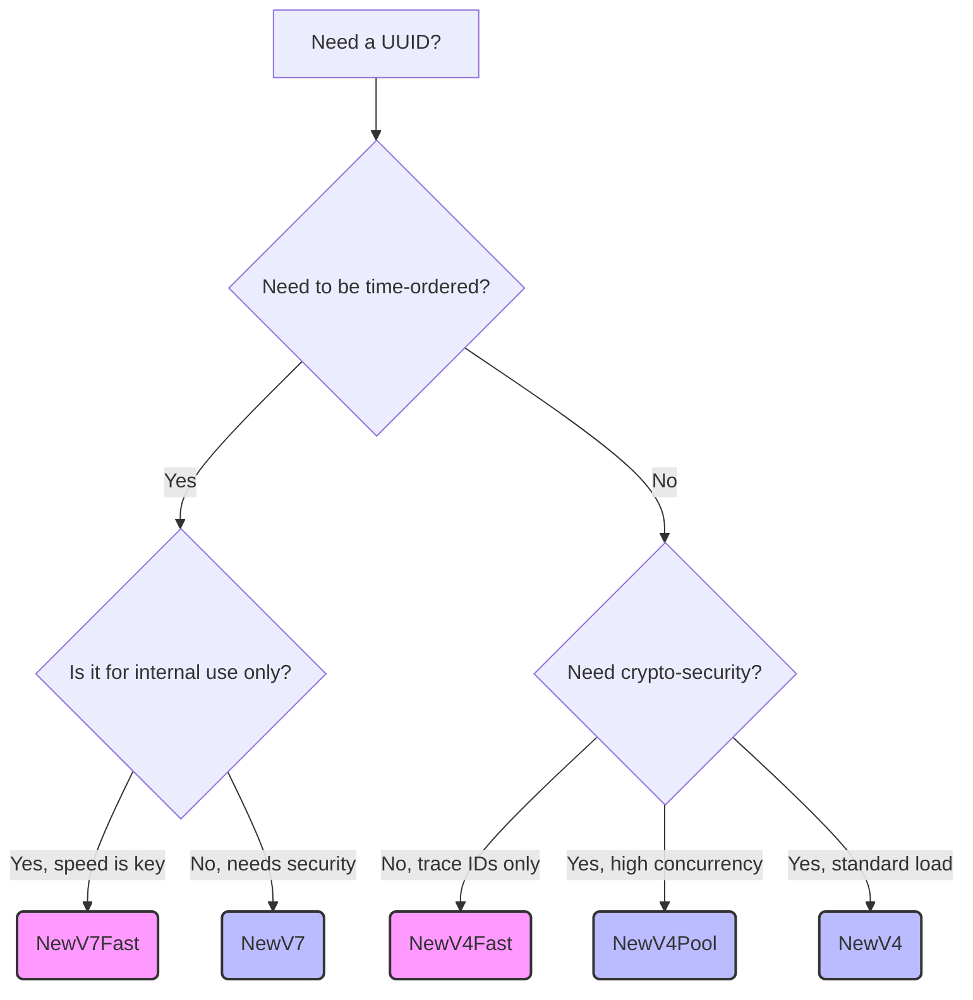

# uuid

High-performance, zero-allocation UUID generator for Go.
Fully compliant with [RFC 4122](https://datatracker.ietf.org/doc/html/rfc4122) and [RFC 9562](https://datatracker.ietf.org/doc/html/rfc9562).

Built to squeeze maximum performance out of the hardware. **Zero mutexes in V4/V7 hot paths**, lock-free CAS implementations for time-based IDs, zero heap allocations, leveraging modern Go runtime features.

## Supported versions

* [x] Version 1 (MAC-address & date-time)
* [x] Version 2 (DCE Security)
* [x] Version 3 (MD5 hash & namespace)
* [x] Version 4 (Random) - 3 implementations available for different load profiles.
* [x] Version 5 (SHA-1 hash & namespace)
* [x] Version 6 (Field-compatible version of UUIDv1)
* [x] Version 7 (Unix Epoch time-ordered) - **Lock-free CAS implementation.**

---

## ⚠️ Security Warning

**DO NOT** use `NewV4Fast()` or `NewV7Fast()` for security-sensitive identifiers (session tokens, API keys, password reset links). They use `math/rand/v2` (ChaCha8), which is optimized for absolute speed, not cryptographic security. 

For externally facing and secure UUIDs, **always** use the standard `NewV4()`, `NewV4Pool()`, or `NewV7()` which rely on the kernel's CSPRNG (`crypto/rand`).

---

## Which generator should I use?

We provide different implementations tailored to specific hardware and security constraints:

### Version 4 (Random)
* **`NewV4()`**: The standard. Cryptographically secure (`crypto/rand`), zero allocations. Use this by default.
* **`NewV4Pool()`**: Uses a `sync.Pool` of random bytes to minimize syscalls. ~2x faster than standard, cryptographically secure. Great for high-concurrency web servers.
* **`NewV4Fast()`**: Uses `math/rand/v2`. Insanely fast, but **NOT cryptographically secure**. Use only for internal trace IDs or non-critical DB rows.

### Version 7 (Time-ordered)
* **`NewV7()`**: The standard. Cryptographically secure random payload (`crypto/rand`), zero allocations, lock-free CAS sequence. Use this by default for database primary keys.
* **`NewV7Fast()`**: Uses `math/rand/v2`. Extreme performance, but **NOT cryptographically secure**.

## Decision Tree



*(Note: Pink nodes denote non-cryptographic, high-speed algorithms)*

---

## Installation

```bash
go get github.com/stdlib/uuid@latest
```

## Why doesn't the API return errors?

Most libraries force you to write boilerplate code like this:

```go
id, err := uuid.NewV4()
if err != nil { ... }

```

In `stdlib/uuid`, we intentionally dropped the `error` return value.

**Reasoning:** In modern Go, reading from the system CSPRNG (`crypto/rand`) or using built-in generators (`math/rand/v2`) cannot "accidentally" fail during normal application runtime. If the OS kernel (e.g., Linux) fails to provide random bytes, the Go runtime will `panic` anyway, as further cryptographic operations are compromised. Returning an error for every UUID generation is cargo-cult programming that pollutes the caller code with useless checks. Our API is clean: you ask for an ID - you get an ID instantly.

## Usage

```go
package main

import (
    "fmt"
    "github.com/stdlib/uuid"
)

func main() {
    // Standard secure V4
    u4 := uuid.NewV4()
    fmt.Println("V4 Secure:", u4.String())

    // Ultra-fast internal V4
    u4fast := uuid.NewV4Fast()
    fmt.Println("V4 Fast:  ", u4fast.String())

    // Time-ordered V7 for databases
    u7 := uuid.NewV7()
    fmt.Println("V7 DB Key:", u7.String())
}

```

## Benchmarks

Tested under high concurrent load (`b.RunParallel`) on 16 cores (Intel Core Ultra 9 285H).

Our algorithms `NewV4Fast` (Per-P state ChaCha8) and `NewV7` (Lock-free CAS + Gosched) demonstrate absolute dominance both in throughput and zero Garbage Collector (GC) pressure.

| Implementation (16 cores)     | Speed (ns/op)   | Allocations (B/op) | Allocs/op |
| ----------------------------- | --------------- | ------------------ | --------- |
| **`stdlib/uuid.NewV4Fast()`** | **1.27 ns/op**  | **0 B/op**         | **0**     |
| `gofrs/uuid.NewV4()`          | 52.62 ns/op     | 16 B/op            | 1         |
| `google/uuid.NewRandom()`     | 54.77 ns/op     | 16 B/op            | 1         |
|                               |                 |                    |           |
| **`stdlib/uuid.NewV7()`**     | **69.09 ns/op** | **0 B/op**         | **0**     |
| `google/uuid.NewV7()`         | 337.6 ns/op     | 16 B/op            | 1         |
| `gofrs/uuid.NewV7()`          | 349.3 ns/op     | 16 B/op            | 1         |
